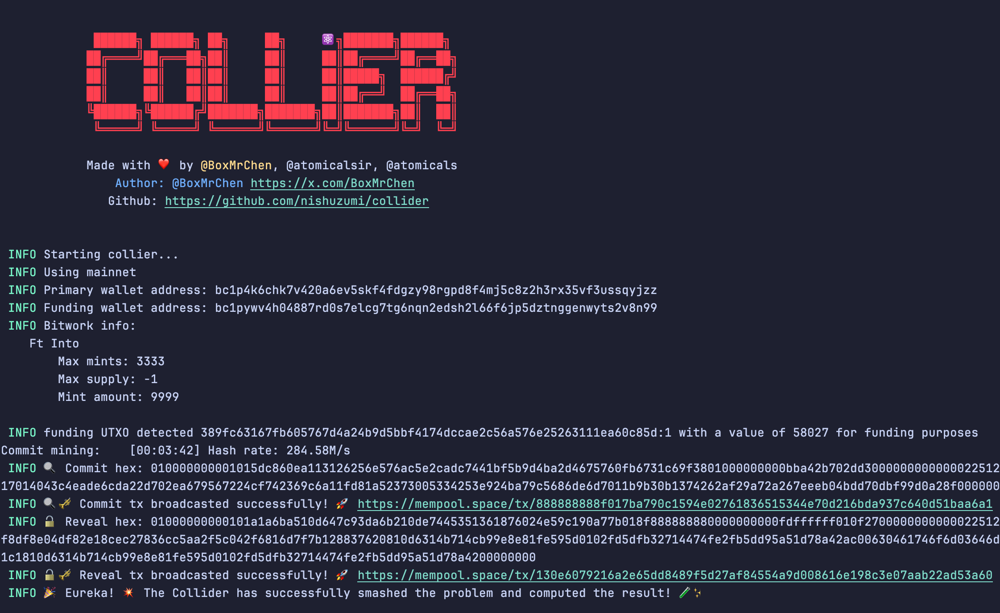

<div align="center">

# Collider
A High-Performance, Open-Source FT Mint Tool for the Atomicals Protocol

***Make Atomicals Great Again***

Collier is a fast and efficient FT (Fungible Token) Mint tool designed for the Atomicals protocol. It harnesses the power of GPU parallel computing to significantly boost the computational performance of the FT Mint process.

In the past, we have seen many FT Mint tools being monopolized by a few individuals or organizations, which is detrimental to the healthy development of the Atomicals ecosystem. To promote the prosperity of the Atomicals community, we have created Collier as an open-source project.

By open-sourcing Collier, we aim to:

Provide a high-performance FT Mint tool that benefits all users of the Atomicals protocol.

Foster openness and inclusivity within the Atomicals community, preventing tool monopolization.

Encourage more developers to participate in building the Atomicals ecosystem, driving its growth together.

Continuously optimize and enhance Collier through the power of the community, making it the standard FT Mint tool for the Atomicals protocol.

We sincerely invite everyone interested in the Atomicals protocol to join the Collier project. Whether you are a developer, designer, or general user, your contributions will be invaluable. Let us work hand in hand to strive for a brighter future for Atomicals!

[](https://www.gnu.org/licenses/agpl-3.0.html)
[](https://github.com/nishuzumi/collider/actions/workflows/release.yml)
[](https://github.com/nishuzumi/collider/tags)
[](https://github.com/nishuzumi/collider)
[](https://github.com/nishuzumi/collider)

Mine the Infinity (888888888.14) within 3 minutes (Lucky)
</div>

## Features

- Customizable verbosity level for detailed logging
- Support for both mainnet and testnet environments
- Configurable base fee for transactions
- Primary wallet and funding wallet management
- Ticker symbol specification
- Choice of mining algorithm (CPU or GPU or custom by your self)

## Getting Started

### Prerequisites

- Rust programming language (latest stable version)
- Cargo package manager

### Installation

#### Option 1: Using Pre-compiled Binaries

1. Download the pre-compiled binary for your operating system from the [releases page](https://github.com/nishuzumi/collider/releases).

2. Extract the downloaded archive to a directory of your choice.

3. Open a terminal and navigate to the directory where you extracted the binary.

#### Option 2: Building from Source

1. Clone the repository:
   ```shell
   git clone https://github.com/yourusername/collider.git
   ```

2. Change to the project directory:
   ```shell
   cd collider
   ```

3. Build the project:
   ```shell
   cargo build --release
   ```
4. The compiled binary will be located at `target/release/collider`.

### Usage

To run the Collider, use the following command:

```shell
./collider [OPTIONS]
```

#### Usage
```shell
Collier 0.1.0
A collier for atomicals.

USAGE:
    collider [FLAGS] [OPTIONS] --funding-wallet <funding-wallet> --primary-wallet <primary-wallet> --ticker <ticker>

FLAGS:
    -h, --help       Prints help information
    -V, --version    Prints version information
    -v, --verbose    Sets the level of verbosity

OPTIONS:
    -a, --api-url <api-url>                   [env: API_URL=]
    -b, --base-fee <base-fee>                 [env: BASE_FEE=]  [default: 50]
    -f, --funding-wallet <funding-wallet>     [env: FUNDING_WALLET=]
    -m, --miner <miner>                       [env: MINER=]  [default: cpu]
    -p, --primary-wallet <primary-wallet>     [env: PRIMARY_WALLET=]
        --testnet <testnet>                   [env: TESTNET=]
    -t, --ticker <ticker>                     [env: TICKER=]

```

You can set these environment variables in a `.env` file in the project root directory. The Collider will automatically load the variables from this file.

Example `.env` file:

```
API_URL=https://api.example.com
TESTNET=true
BASE_FEE=100
PRIMARY_WALLET=your_primary_wallet_address
FUNDING_WALLET=your_funding_wallet_private_key
TICKER=YOUR_TICKER
MINER=cpu
```

## Performance
The following table shows the performance benchmarks
```
CPU Name: Apple M3 Max
GPU Name: Apple M3 Max (OpenCL Version: 1.2)
+--------+------------------------+------------------------+
| Device | Commit Hash Rate (M/s) | Reveal Hash Rate (M/s) |
+--------+------------------------+------------------------+
| CPU    | 91.41M/s               | 150.45M/s              |
+--------+------------------------+------------------------+
| GPU    | 462.07M/s              | 604.54M/s              |
+--------+------------------------+------------------------+
```
```
CPU Name: AMD Ryzen 7 7800X3D 8-Core Processor
GPU Name: NVIDIA GeForce RTX 4090 (OpenCL Version: 3.0)
+--------+------------------------+------------------------+
| Device | Commit Hash Rate (M/s) | Reveal Hash Rate (M/s) |
+--------+------------------------+------------------------+
| CPU    | 69.96M/s               | 97.92M/s               |
+--------+------------------------+------------------------+
| GPU    | 1.16B/s                | 1.49B/s                |
+--------+------------------------+------------------------+
```

You can test your device by running the following command:
```shell
./collider --benchmark
```
## Contributing

Contributions are welcome! If you find any issues or have suggestions for improvements, please open an issue or submit a pull request.

## Roadmap
[] Add multi task feature - it will allow user use one utxo to mint 100 times in less gas and time.

[] Improve the performance - The high performance version is currently closed source, if you are interested you can contact me.

[] Add pure mode - By using public rpc for higher speed calculations, pure mode will not recognize any assets of the funding wallet.

## License

This project is licensed under the GNU AFFERO GENERAL PUBLIC LICENSE.

## Acknowledgements

[Atomicals](https://atomicals.xyz/) - The Atomicals protocol

[Atomicalsir](https://github.com/hack-ink/atomicalsir) - For providing the foundation and inspiration for this project

## Contact

For any inquiries or questions, please contact [boxmrchen@fastmail.com](mailto:boxmrchen@fastmail.com).